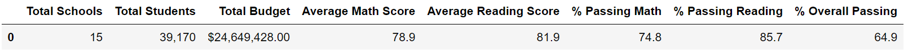
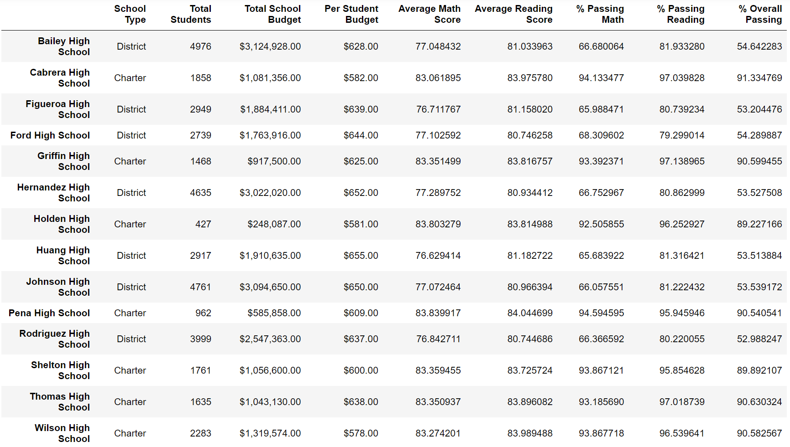
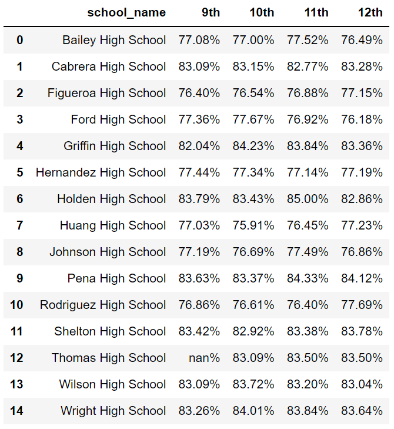
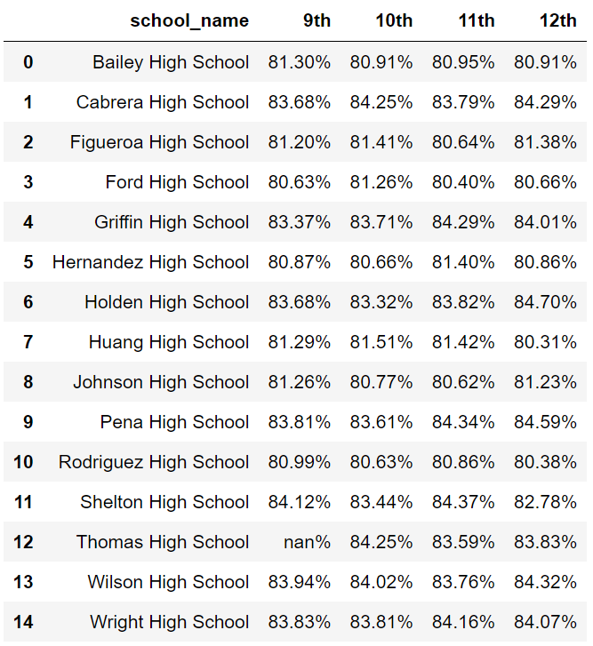
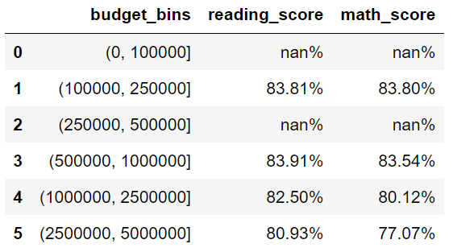
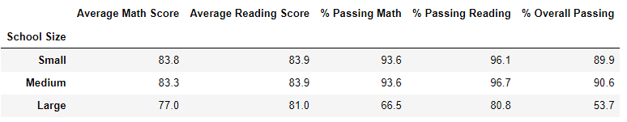
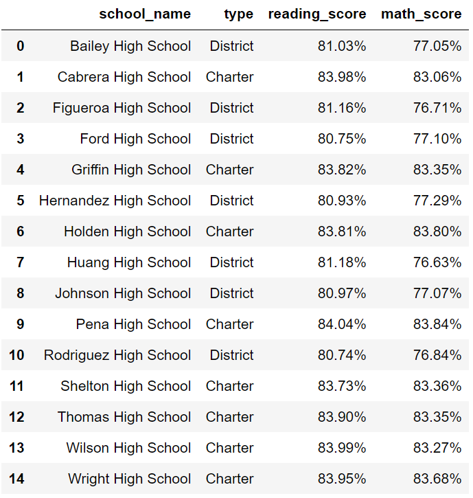

# School_District_Analysis

## Overview of the school district analysis

### Purpose of this analysis.

In response to the school board finding evidence of academic dishonesty in the students_complete.csv file, we are tasked with cleaning and summarizing the data. Because the reading and math grades for Thomas High School ninth graders were altered, we must replace the math and reading scores for Thomas High School with NaNs while keeping the rest of the data intact to uphold state-testing standards. Once the math and reading scores are replaced, the school district analysis can be repeated with the newly cleaned data to find how these changes affected the overall analysis.

## Results

* How was the district summary affected?

After removing the math and reading scores for 9th graders at Thomas High School, the average scores and passing percentages decreased in the district summary table.

* How was the school summary affected?

After removing the math and reading scores for 9th graders at Thomas High School, the average scores and passing percentages decreased for Thomas High School in the school summary table.

* Effect of Replacing the Ninth Graders’ Math and Reading Scores on Thomas High School’s Performance Relative to the Other Schools

Thomas High School remains a top-ranked school by scores after replacing the 9th graders' math and reading scores.

* Effect of Replacing the Ninth-Grade Scores

- Effect on Math and Reading Scores by Grade

Thomas High School no longer has math and reading score data for their 9th graders. All other scores by grade did not change.

- Effect on Scores by School Spending

The grade replacement did not have a major impact on scores by school spending.

- Effect on Scores by School Size

The grade replacement did not have a major impact on scores by school size.

- Effect on Scores by School Type

The grade replacement did not have a major impact on scores by school type.

## Summary

### Changes in the Updated School District Analysis

After the reading and math scores for the ninth grade at Thomas High School have been replaced with NaNs, several changes occurred in the dataset. In addition to changing the score averages, removing these passing scores decreased the overall passing percentage. This change did not majorly affect the aggregated scores in summaries by spending, size or type.
